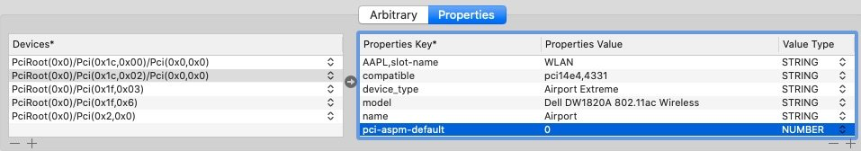

# Broadcom BCM94350Zae Hardware Support In macOS
---

**Supports all variants of the Broadcom BCM94350Zae (BCM4350) chipset currently available as NGFF A/E based Wireless AC and Bluetooth 4.1 hardware!**

### Fully Supported Hardware in macOS Yosemite - Catalina:

- Dell DW1820a 802.11 AC Wireless Network & Bluetooth 4.1 LE NGFF Card! Includes Revisions:
  - CV-OVW3T3
  - CN-096JNT
  - CN-0VW3T3
  - CN-08PKF4
  
- Lenovo 00JT493 802.11 AC Wireless Network & Bluetooth 4.1 LE NGFF Card.

- Foxcon T77H649 802.11 AC Wireless Network & Bluetooth 4.1 LE NGFF Card.

### Background:

- Hacintosh users looking for inexpensive AC wifi solution have run in to a number of issues across any of the handful of known variants of the BCM94350Zae hardware thats currently on the market. Dell Dw1820a (which is the most common and happens to have 5 seperate hardware revisions with vastly different reports), Lenovo 00JT493, and Foxcon T77H649 are all using thois chipset. I spent months myself trying to put together a reasonable configuration and eventually gave up due to a complete instability no matter what I tried. Some folks over at OSXdaily continued with what I threw in the towel on and after months and months of collaboration on user Herve's thread dedicated to the topic they have managed to solve the problem that was causing all variants of this hardware to be so unstable rendering this chipset and all variants as viable of an option as cards like the DW1560 at a fraction of the price. 
---
## Solution:

- The issue can be solved by adding the device property setting "pci-aspm-default" with a Number based definition of "0" in clovers Devices/Properties section under the PciRoot address that you system assigns to the actual card (which is not universal and needs to be known in order for you to create the property patch with clover configurator in the config.plist or with a DSDT patch which is how you can resolve the problem!

### Instructions: 

- You may use the config.plist or the DSDT patch. I would go with the plist method as its easier. The actual fix that will enable the proper functionality of this card no matter which version or manufacturer you're using is the addition of the device property : "pci-aspm-default" with a return of "0" as a "Number" based property under Devices/Properties/PciRootxxx 

- PciRootxxx refers to the proper address of the card in your system which youll need to find as it may not be the same as whats in these files!!! Use your IOREG layout to determine the proper location.

- The same applies for the address thats used in the SSDT file! Your hardware may be different and if it is the proper settings need to be changed in the DSDT patch file for the patch to work.

---

### All Credit Goes To: 

Herve - (https://osxlatitude.com/forums/topic/11322-broadcom-bcm4350-cards-under-high-sierramojavecatalina/?tab=comments#comment-96996)

